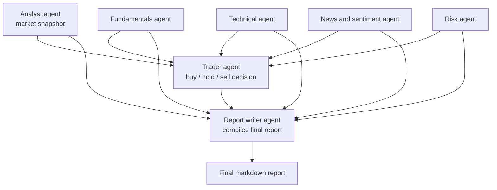

# Stock Researcher Workflow

A multi-agent research pipeline built with CrewAI that turns a single stock ticker into a structured, well-sourced investment research report.

Specialized agents independently analyze fundamentals, technicals, news sentiment, and risk using live market data, enriched with web search context. A trader agent synthesizes these findings into a Buy/Hold/Sell view, and a report writer agent compiles everything into one coherent markdown report.

This project is designed for research and analysis — organizing publicly available signals into a single readable document — rather than as a standalone trading signal generator. Its output should be treated as a starting point for further human judgment, not financial advice.

## Workflow diagram



The four data-gathering agents run first and can be coordinated by a manager agent for delegation. Their outputs feed the trader agent, whose recommendation and every prior analysis feed the report writer agent, which produces the final report.

## Agents

| Agent | Role |
|---|---|
| `analyst_agent` | Pulls a real-time price and market snapshot for the ticker |
| `fundamentals_agent` | Analyzes financial statements and valuation ratios (P/E, EPS, ROE, debt/equity) |
| `technical_agent` | Computes moving averages, RSI, MACD, and identifies trend and momentum |
| `news_agent` | Gathers recent news headlines and classifies sentiment as bullish, bearish, or neutral |
| `risk_agent` | Calculates beta versus a benchmark, volatility, and maximum drawdown |
| `trader_agent` | Synthesizes all prior analysis into a Buy/Hold/Sell recommendation with a target price range |
| `report_writer_agent` | Compiles every task's output into one polished, structured markdown report |
| `manager_agent` (optional) | Coordinates the four data-gathering agents when using a hierarchical process |

## Tools

- `get_stock_price`, `get_historical_prices` — live and historical price data
- `get_financial_statements`, `get_key_ratios` — fundamentals data
- `get_technical_indicators` — SMA, RSI, MACD, 52-week high/low
- `get_company_news` — recent headlines
- `search_news_context` — enriches headlines with fuller context via web search
- `calculate_beta_volatility` — beta, annualized volatility, max drawdown
- `save_report_to_markdown` — saves the final report to disk

## Project structure

```
.
├── pyproject.toml
├── README.md
└── stock_researcher_workflow/
    ├── __init__.py
    ├── cli.py
    ├── crew.py
    ├── agents/
    │   ├── analyst_agent.py
    │   ├── fundamental_agent.py
    │   ├── technical_agent.py
    │   ├── news_agent.py
    │   ├── risk_agent.py
    │   ├── trader_agent.py
    │   ├── report_writer_agent.py
    ├── tasks/
    │   ├── analyse_task.py
    │   ├── fundamental_task.py
    │   ├── technical_task.py
    │   ├── news_task.py
    │   ├── risk_task.py
    │   ├── trade_task.py
    │   └── report_task.py
    ├── tools/
    │   ├── fundamental_research_tools.py
    │   ├── stock_risk_tools.py
    │   ├── technical_research_tools.py
    │   ├── stock_research_tools.py
    │   ├── news_search_tools.py
    │   └── report_tools.py
```

## Install and run (no clone needed)

Requires [uv](https://docs.astral.sh/uv/getting-started/installation/).

Run once without installing anything permanently:

```bash
uvx --from git+https://github.com/yourname/stock-researcher-workflow stock-researcher AAPL
```

Or install it once as a permanent command:

```bash
uv tool install git+https://github.com/yourname/stock-researcher-workflow
stock-researcher AAPL
```

### API keys

Never pass keys directly on the command line or export them into your shell — the tool resolves them safely in this order:

1. **A `.env` file** in the directory where you run the command:
   ```
   GEMINI_API_KEY=your-gemini-api-key
   SERPER_API_KEY=your-serper-api-key
   ```
2. **A hidden interactive prompt** — if no `.env` file is found, the tool asks for each key at runtime. Input is masked as you type and is never written to disk or shell history.

This means first-time users can just run the command with no setup step at all — they'll be prompted for keys the first time, and can drop a `.env` file later if they don't want to be asked again.

## Local development

Clone the repo and install with `uv` in editable mode:

```bash
git clone https://github.com/yourname/stock-researcher-workflow
cd stock-researcher-workflow
uv sync
uv run stock-researcher AAPL
```

## Notes

- Task execution order and data flow are enforced through each task's `context` dependencies, so agents downstream always receive the analysis they depend on.
- The manager agent and hierarchical process are optional. A single sequential crew with no manager produces the same report with less overhead, and is the recommended default unless you specifically need dynamic delegation across the research agents.
- All recommendations produced by the trader agent are generated from publicly available data and LLM reasoning. They are not backtested trading signals and should not be used as financial advice.