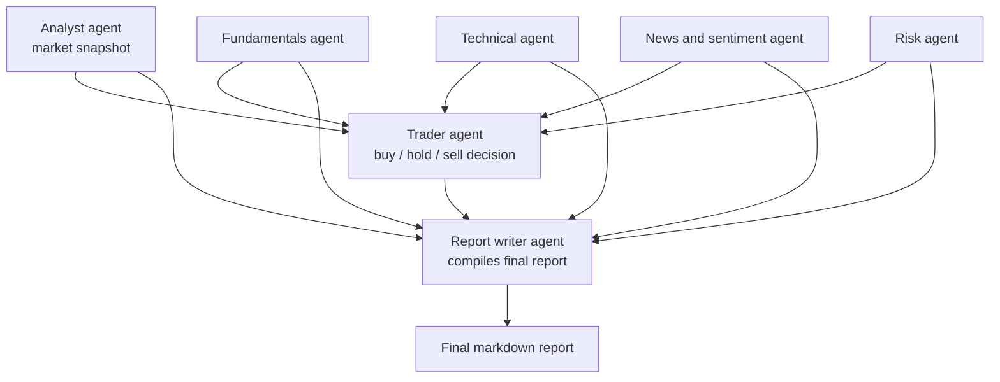

# Stock Researcher Workflow

A multi-agent research pipeline built with CrewAI that turns a single stock ticker into a structured, well-sourced investment research report.

Specialized agents independently analyze fundamentals, technicals, news sentiment, and risk using live market data, enriched with web search context. A trader agent synthesizes these findings into a Buy/Hold/Sell view, and a report writer agent compiles everything into one coherent markdown report.

This project is designed for research and analysis — organizing publicly available signals into a single readable document — rather than as a standalone trading signal generator. Its output should be treated as a starting point for further human judgment, not financial advice.

## Workflow diagram



The four data-gathering agents run first and can be coordinated by a manager agent for delegation. Their outputs feed the trader agent, whose recommendation and every prior analysis feed the report writer agent, which produces the final report.

## Agents

| Agent | Role |
|---|---|
| `analyst_agent` | Pulls a real-time price and market snapshot for the ticker |
| `fundamentals_agent` | Analyzes financial statements and valuation ratios (P/E, EPS, ROE, debt/equity) |
| `technical_agent` | Computes moving averages, RSI, MACD, and identifies trend and momentum |
| `news_agent` | Gathers recent news headlines and classifies sentiment as bullish, bearish, or neutral |
| `risk_agent` | Calculates beta versus a benchmark, volatility, and maximum drawdown |
| `trader_agent` | Synthesizes all prior analysis into a Buy/Hold/Sell recommendation with a target price range |
| `report_writer_agent` | Compiles every task's output into one polished, structured markdown report |
| `manager_agent` (optional) | Coordinates the four data-gathering agents when using a hierarchical process |

## Tools

- `get_stock_price`, `get_historical_prices` — live and historical price data
- `get_financial_statements`, `get_key_ratios` — fundamentals data
- `get_technical_indicators` — SMA, RSI, MACD, 52-week high/low
- `get_company_news` — recent headlines
- `search_news_context` — enriches headlines with fuller context via web search
- `calculate_beta_volatility` — beta, annualized volatility, max drawdown
- `save_report_to_markdown` — saves the final report to disk

## Project structure

```
.
├── pyproject.toml
├── README.md
└── stock_researcher_workflow/
    ├── __init__.py
    ├── cli.py
    ├── crew.py
    ├── agents/
    │   ├── analyst_agent.py
    │   ├── fundamental_agent.py
    │   ├── technical_agent.py
    │   ├── news_agent.py
    │   ├── risk_agent.py
    │   ├── trader_agent.py
    │   ├── report_writer_agent.py
    ├── tasks/
    │   ├── analyse_task.py
    │   ├── fundamental_task.py
    │   ├── technical_task.py
    │   ├── news_task.py
    │   ├── risk_task.py
    │   ├── trade_task.py
    │   └── report_task.py
    ├── tools/
    │   ├── fundamental_research_tools.py
    │   ├── stock_risk_tools.py
    │   ├── technical_research_tools.py
    │   ├── stock_research_tools.py
    │   ├── news_search_tools.py
    │   └── report_tools.py
```

---

## Setup

### Prerequisites

Before installing, ensure you have:

- Python **3.12.x** (recommended)
- Git
- `uv`

Verify your installation:

```bash
python --version
uv --version
git --version
```

If Python 3.12 is not installed:

```bash
uv python install 3.12
```

Verify:

```bash
uv python list
```

### Installation

Install directly from GitHub using `uv`:

#### Windows

```cmd
uv tool install --python 3.12 git+https://github.com/Dhruv0714/Stock-Research-Workflow-
```

#### macOS / Linux

```bash
uv tool install --python 3.12 git+https://github.com/Dhruv0714/Stock-Research-Workflow-
```

Verify the installation:

```bash
uv tool list
```

Expected output:

```
stock-researcher-workflow
└── stock-researcher
```

### API keys

The application requires:

- Google Gemini API Key
- Serper API Key

#### Gemini API Key

1. Visit: https://aistudio.google.com/app/apikey
2. Create a new API key.
3. Copy it for the next step.

#### Serper API Key

1. Visit: https://serper.dev
2. Sign in.
3. Generate an API key.

### Environment variables

Create a `.env` file in your project directory:

```env
GEMINI_API_KEY=
GEMINI_API_MODEL=gemini/gemini-3.1-flash-lite
SERPER_API_KEY=
```

Example:

```env
GEMINI_API_KEY=AIzaSyXXXXXXXXXXXXXXXXXXXXXXXX
GEMINI_API_MODEL=gemini/gemini-3.1-flash-lite
SERPER_API_KEY=XXXXXXXXXXXXXXXXXXXXXXXX
```
or set env variables from the terminal
```
set GEMINI_API_KEY=AIzaSyXXXXXXXXXXXXXXXXXXXXXXXX
set GEMINI_API_MODEL=gemini/gemini-3.1-flash-lite
set SERPER_API_KEY=XXXXXXXXXXXXXXXXXXXXXXXX
```

> **Note**
>
> `GEMINI_API_MODEL` should normally remain:
>
> ```text
> gemini/gemini-3.1-flash-lite
> ```

### Running the application

Analyze Apple:

```bash
stock-researcher
```

### Example output

The workflow generates a report containing:

- Company Overview
- Financial Fundamentals
- Recent News
- Market Sentiment
- Risks
- Growth Opportunities
- Investment Summary

### Updating

To install the latest version:

```bash
uv tool uninstall stock-researcher-workflow

uv tool install --python 3.12 git+https://github.com/Dhruv0714/Stock-Research-Workflow-
```

### Uninstall

```bash
uv tool uninstall stock-researcher-workflow
```

### Troubleshooting

**`KeyError: 'GEMINI_API_KEY'`**

Your `.env` file is missing:

```env
GEMINI_API_KEY=YOUR_API_KEY
```

**`KeyError: 'GEMINI_API_MODEL'`**

Your `.env` file is missing:

```env
GEMINI_API_MODEL=gemini/gemini-3.1-flash-lite
```

**`KeyError: 'SERPER_API_KEY'`**

Your `.env` file is missing:

```env
SERPER_API_KEY=YOUR_SERPER_API_KEY
```

**ChromaDB / Pydantic / Python 3.14 error**

If you encounter errors similar to:

```
Core Pydantic V1 functionality isn't compatible with Python 3.14
```

or

```
pydantic.v1.errors.ConfigError
```

Reinstall the tool using Python **3.12**:

```bash
uv tool uninstall stock-researcher-workflow

uv tool install --python 3.12 git+https://github.com/Dhruv0714/Stock-Research-Workflow-
```

**Verify installation**

```bash
python --version

uv --version

uv tool list
```

Expected:

```
Python 3.12.x
```

and

```
stock-researcher-workflow
└── stock-researcher
```

---

## Local development

Clone the repo and install with `uv` in editable mode:

```bash
git clone https://github.com/Dhruv0714/Stock-Research-Workflow-
cd Stock-Research-Workflow-
uv sync
uv run stock-researcher AAPL
```

## Notes

- Task execution order and data flow are enforced through each task's `context` dependencies, so agents downstream always receive the analysis they depend on.
- The manager agent and hierarchical process are optional. A single sequential crew with no manager produces the same report with less overhead, and is the recommended default unless you specifically need dynamic delegation across the research agents.
- All recommendations produced by the trader agent are generated from publicly available data and LLM reasoning. They are not backtested trading signals and should not be used as financial advice.

## Tech stack

- CrewAI
- Google Gemini
- Serper
- Python
- uv
- yFinance

## Author
**Dhruv Shah**
GitHub: https://github.com/Dhruv0714